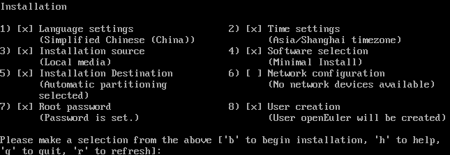
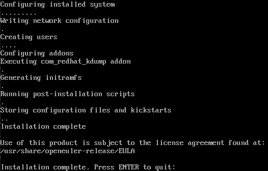

# Completing the Installation

After all mandatory items are configured on the installation overview page, the alarm symbols  **\[!\]**  will disappear. In this case, enter  **b**  to install the system.

**Figure  1**  Starting installation  

**Figure  2**  Pressing  **Enter**  to restart the system after the installation is complete  

-   If the physical DVD-ROM is used to install the OS and the DVD-ROM drive is not automatically ejected during the restart, manually remove the DVD-ROM. Then, the openEuler CLI login page is displayed.
-   If the virtual DVD-ROM drive is used to install the OS, change the server boot option to  **Hard Disk**  and restart the server. Then, the openEuler CLI login page is displayed.

> **NOTE:**   
>-   Because the BIOS reserves memory, the total memory \(indicated by  **MemTotal**\) is slightly different before and after the system restart.  
>-   After the system is installed, the kdump function is disabled by default. To use the kdump function, manually enable it. For details, see  **FAQs \> How Do I Manually Enable the kdump Service?**  

