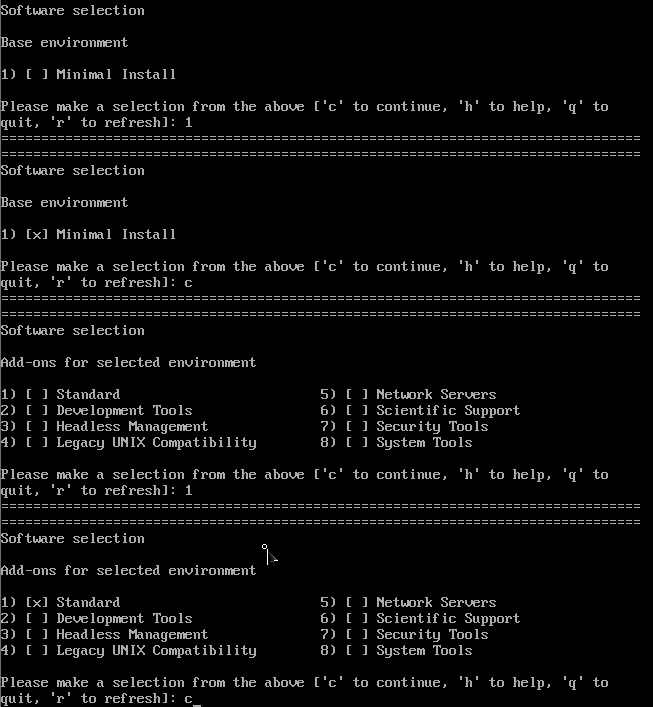

# Selecting Installation Software

Enter  **4**  on the installation overview page, and then press  **Enter**  to specify the software package to be installed.

-   Minimal Install: Minimum environment. Provide basic functions of openEuler. By default, openEuler is installed in the minimum environment mode.

After entering  **c**  on the installation environment interface, you can select the software packages to be installed by selecting  **Add-ons**, as shown in the following figure.

**Figure  1**  Installing software  

Enter **1** and press **Enter** to select **Standard**, then enter **c** to return to the installation overview page.

The optional  **Add-ons**  packages vary depending on the installation environment.

-   Standard: standard installation. openEuler standard installation.
-   Development Tools: Development tools. Basic development environment.
-   Headless Management: Non graphical terminal system management tool. This tool is used to manage a non-image terminal system.
-   Legacy UNIX Compatibility: Traditional UNIX compatibility. This compatibility program is used for the migration from an inherited UNIX environment or used in the environment.
-   Network Servers: Network server. These packages include network-based servers such as DHCP, Kerberos, and NIS.
-   Scientific Support: Scientific notation support. This tool is used for mathematical and scientific computing and parallel computing.
-   Security Tools: Security tool. This tool is used for integrity and trustworthiness verification.
-   System Tools: System tool. This set of software packages is a collection of various system tools, for example, the tool used for connecting to customers shared by SMB and the tool used for monitoring network traffic.

After the configuration is complete, enter  **c**  to return to the installation overview page.

