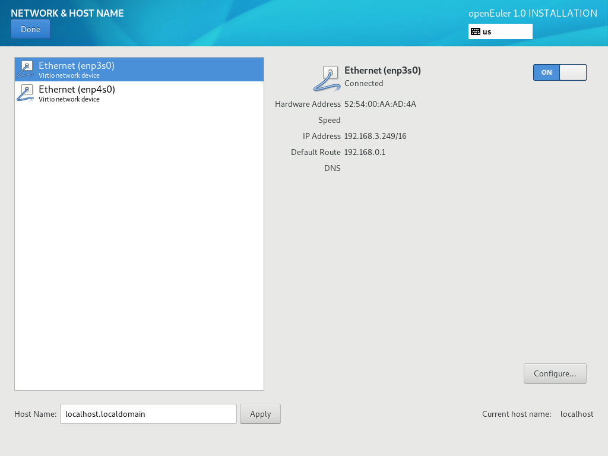

# Setting the Network and Host Name

On the  **INSTALLATION SUMMARY**  page, select  **NETWORK & HOST NAME**  to configure the system network functions.

The installation program automatically detects a local access interface. The detected interface is listed in the left box, and the interface details are displayed in the right-hand area, as shown in  [Figure 1](#en-us_topic_0186390264_en-us_topic_0122145831_fig123700157297). In the upper right corner, click the switchover button to enable or disable the network interface. You can also click  **Configure**  to configure the selected interface.

In the lower left box, enter the host name. The host name can be the fully quantified domain name \(format: hostname.domainname\) or the brief host name \(format: hostname\).

**Figure  1**  Setting the network and host name  

After the setting is complete, click  **Done**  in the upper left corner to go back to the  **INSTALLATION SUMMARY**  page.

