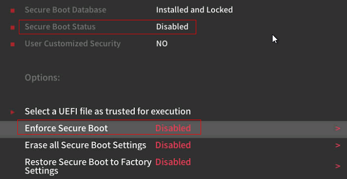

# FAQs
<!-- TOC -->

- [FAQs](#faqs)
    - [Why Does openEuler Fail to Start After I Install It to the Second Disk?](#why-does-openeuler-fail-to-start-after-i-install-it-to-the-second-disk)
    - [Why Does openEuler Enter Emergency Mode After It Is Powered On?](#why-does-openeuler-enter-emergency-mode-after-it-is-powered-on)
    - [Failed to Reinstall openEuler When a Logical Volume Group That Cannot Be Activated Has Existed in openEuler](#failed-to-reinstall-openeuler-when-a-logical-volume-group-that-cannot-be-activated-has-existed-in-openeuler)
    - [An Exception Occurs During the Selection of the Installation Source](#an-exception-occurs-during-the-selection-of-the-installation-source)
    - [How Do I Manually Enable the kdump Service?](#how-do-i-manually-enable-the-kdump-service)
    - [Failed to Selected Only One Disk for Reinstallation When openEuler Was Installed on a Logical Volume Consisting of Multiple Disks](#failed-to-selected-only-one-disk-for-reinstallation-when-openeuler-was-installed-on-a-logical-volume-consisting-of-multiple-disks)
    - [Failed to Install openEuler on an x86 PM in UEFI Mode due to Secure Boot Option Setting](#failed-to-install-openeuler-on-an-x86-pm-in-uefi-mode-due-to-secure-boot-option-setting)

<!-- /TOC -->

## Why Does openEuler Fail to Start After I Install It to the Second Disk?

### Symptom

The OS is installed on the second disk  **sdb**  during the installation. The openEuler fails to be started.

### Possible Cause

When openEuler is installed to the second disk, MBR and GRUB are installed to the second disk  **sdb**  by default. The following two situations may occur:

1.  openEuler installed on the first disk is loaded and started if it is complete.
2.  openEuler installed on the first disk fails to be started from hard disks if it is incomplete.

The preceding two situations occur because the first disk  **sda**  is booted by default to start openEuler on the BIOS window. If openEuler is not installed on the  **sda**  disk, system restart fails.

### Solution

This problem can be solved using either of the following two methods:

-   During the installation of openEuler, select the first disk or both disks, and install the boot loader on the first disk  **sda**.
-   After installing openEuler, restart it by modifying the boot option on the BIOS window.


## Why Does openEuler Enter Emergency Mode After It Is Powered On?

### Symptom

openEuler enters emergency mode after it is powered on.


### Possible Causes

Damaged OS files result in disk mounting failure, or overpressured I/O results in disk mounting timeout \(threshold: 90s\).

An unexpected system power-off, and low I/O performance of disks may also cause the problem.

### Solution

1.  Enter the password of the  **root**  account to log in to openEuler.
2.  Check and restore files by using the file system check \(fsck\) tool, and restart openEuler.

    > **NOTE:**   
    >The fsck tool checks and maintains inconsistent file systems. If the system is powered off or a disk is faulty, run the  **fsck**  command to check file systems. Run the  **fsck.ext3 -h**  and  **fsck.ext4 -h**  commands to view the usage method of the fsck tool.  


If you want to disable the timeout mechanism of disk mounting, add  **x-systemd.device-timeout=0**  to the  **etc/fstab**  file. For example:

```
#
# /etc/fstab
# Created by anaconda on Mon Sep 14 17:25:48 2015
#
# Accessible filesystems, by reference, are maintained under '/dev/disk'
# See man pages fstab(5), findfs(8), mount(8) and/or blkid(8) for more info
#
/dev/mapper/openEuler-root / ext4 defaults,x-systemd.device-timeout=0 0 0
UUID=afcc811f-4b20-42fc-9d31-7307a8cfe0df /boot ext4 defaults,x-systemd.device-timeout=0 0 0
/dev/mapper/openEuler-home /home ext4 defaults 0 0
/dev/mapper/openEuler-swap swap swap defaults 0 0
```

## Failed to Reinstall openEuler When a Logical Volume Group That Cannot Be Activated Has Existed in openEuler

### Symptom

After a disk fails, openEuler fails to be reinstalled because a logical volume group that cannot be activated has existed in openEuler.

### Possible Cause

During the installation of openEuler, a logical volume group cannot be activated.

### Solution

Before reinstalling openEuler, restore the abnormal logical volume group to the normal status or clear it. The following uses an example:

-   Restore the logical volume group.
    1.  Run the following command to clear the active status of the abnormal logical volume group to ensure that the error message "Can't open /dev/sdc exclusively mounted filesystem" is not displayed:

        ```
         vgchange -a n testvg32947
        ```

    2.  Run the following command to recreate a physical volume based on the backup file:

        ```
        pvcreate --uuid JT7zlL-K5G4-izjB-3i5L-e94f-7yuX-rhkLjL --restorefile /etc/lvm/backup/testvg32947 /dev/sdc
        ```

    3.  Run the following command to restore the logical volume group information:

        ```
        vgcfgrestore testvg32947
        ```

    4.  Run the following command to reactivate the logical volume group:

        ```
         vgchange -ay testvg32947
        ```


-   Run the following commands to clear the logical volume group:

    ```
    vgchange -a n testvg32947
    vgremove -y testvg32947
    ```


## An Exception Occurs During the Selection of the Installation Source

### Symptom

After the selection of the installation source, the message "Error checking software selection" is displayed.

### Possible Cause

This is because the software package dependency in the installation source is abnormal.

### Solution

Check whether the installation source is abnormal. Use the new installation source.

## How Do I Manually Enable the kdump Service?

### Symptom

Run the  **systemctl status kdump**  command. The following information is displayed, indicating that no memory is reserved.


### Possible Cause

The kdump service requires the system to reserve memory for running the kdump kernel. However, the system does not reserve memory for the kdump service. As a result, the kdump service cannot be started.

### Solution

For the scenario where the OS has been installed

1.  Add  **crashkernel=1024M,high**  to  **/boot/efi/EFI/openEuler/grub.cfg**.
2.  Restart the system for configuration to take effect.
3.  Run the following command to check the kdump status:

    ```
    systemctl status kdump
    ```

    If the following information is displayed, the kdump status is  **active**, indicating that the kdump service is enabled. No further action is required.

    


### Parameter Description

The following table describes the parameters of the memory reserved for the kdump kernel.

**Table  1**  crashkernel parameters

<a name="table467312804815"></a>
<table><thead align="left"><tr id="row967318810483"><th class="cellrowborder" valign="top" width="25%" id="mcps1.2.5.1.1"><p id="p188941929182618"><a name="p188941929182618"></a><a name="p188941929182618"></a>Kernel Boot Parameter</p>
</th>
<th class="cellrowborder" valign="top" width="25%" id="mcps1.2.5.1.2"><p id="p389410298262"><a name="p389410298262"></a><a name="p389410298262"></a>Description</p>
</th>
<th class="cellrowborder" valign="top" width="25%" id="mcps1.2.5.1.3"><p id="p158944290262"><a name="p158944290262"></a><a name="p158944290262"></a>Default Value</p>
</th>
<th class="cellrowborder" valign="top" width="25%" id="mcps1.2.5.1.4"><p id="p18894429132612"><a name="p18894429132612"></a><a name="p18894429132612"></a>Remarks</p>
</th>
</tr>
</thead>
<tbody><tr id="row26739804810"><td class="cellrowborder" valign="top" width="25%" headers="mcps1.2.5.1.1 "><p id="p1089402918267"><a name="p1089402918267"></a><a name="p1089402918267"></a>crashkernel=X</p>
</td>
<td class="cellrowborder" valign="top" width="25%" headers="mcps1.2.5.1.2 "><p id="p10894142915265"><a name="p10894142915265"></a><a name="p10894142915265"></a>Reserve X of the physical memory for kdump when the physical memory is less than 4 GB.</p>
</td>
<td class="cellrowborder" valign="top" width="25%" headers="mcps1.2.5.1.3 "><p id="p1894229162614"><a name="p1894229162614"></a><a name="p1894229162614"></a>None. You can adjust the value as required.</p>
</td>
<td class="cellrowborder" valign="top" width="25%" headers="mcps1.2.5.1.4 "><p id="p2895429202612"><a name="p2895429202612"></a><a name="p2895429202612"></a>This configuration method is used only when the memory is less than 4 GB. Ensure that the continuous available memory is sufficient.</p>
</td>
</tr>
<tr id="row16731682484"><td class="cellrowborder" valign="top" width="25%" headers="mcps1.2.5.1.1 "><p id="p589512962618"><a name="p589512962618"></a><a name="p589512962618"></a>crashkernel=X@Y</p>
</td>
<td class="cellrowborder" valign="top" width="25%" headers="mcps1.2.5.1.2 "><p id="p10895329112616"><a name="p10895329112616"></a><a name="p10895329112616"></a>Reserve X of the memory at the start address Y for kdump.</p>
</td>
<td class="cellrowborder" valign="top" width="25%" headers="mcps1.2.5.1.3 "><p id="p1989572917263"><a name="p1989572917263"></a><a name="p1989572917263"></a>None. You can adjust the value as required.</p>
</td>
<td class="cellrowborder" valign="top" width="25%" headers="mcps1.2.5.1.4 "><p id="p6895329142617"><a name="p6895329142617"></a><a name="p6895329142617"></a>Ensure that the X of the memory at the start address Y is not reserved for other modules.</p>
</td>
</tr>
<tr id="row6674198124814"><td class="cellrowborder" valign="top" width="25%" headers="mcps1.2.5.1.1 "><p id="p3895829132620"><a name="p3895829132620"></a><a name="p3895829132620"></a>crashkernel=X,high</p>
</td>
<td class="cellrowborder" valign="top" width="25%" headers="mcps1.2.5.1.2 "><p id="p589582910260"><a name="p589582910260"></a><a name="p589582910260"></a>Reserve 256 MB of the physical memory for kdump when the physical memory is less than 4 GB, and X of the physical memory for kdump when the physical memory is greater than or equal to 4 GB.</p>
</td>
<td class="cellrowborder" valign="top" width="25%" headers="mcps1.2.5.1.3 "><p id="p589516295260"><a name="p589516295260"></a><a name="p589516295260"></a>None. You can adjust the value based as required. The recommended value is <strong id="b181922057954"><a name="b181922057954"></a><a name="b181922057954"></a>1024M,high</strong>.</p>
</td>
<td class="cellrowborder" valign="top" width="25%" headers="mcps1.2.5.1.4 "><p id="p389520290261"><a name="p389520290261"></a><a name="p389520290261"></a>Ensure that 256 MB of the memory is reserved for continuous use when the physical memory is less than 4 GB and X of the memory is reserved when the physical memory is greater than or equal to 4 GB. The actual reserved memory size equals 256 MB plus X.</p>
</td>
</tr>
<tr id="row18674138204811"><td class="cellrowborder" valign="top" width="25%" headers="mcps1.2.5.1.1 "><p id="p189512918262"><a name="p189512918262"></a><a name="p189512918262"></a>crashkernel=X,low</p>
<p id="p2895162915268"><a name="p2895162915268"></a><a name="p2895162915268"></a>crashkernel=Y,high</p>
</td>
<td class="cellrowborder" valign="top" width="25%" headers="mcps1.2.5.1.2 "><p id="p15895102916261"><a name="p15895102916261"></a><a name="p15895102916261"></a>Reserve X of the physical memory for kdump when the physical memory is less than 4 GB and Y of the physical memory for kdump when the physical memory is greater than or equal to 4 GB.</p>
</td>
<td class="cellrowborder" valign="top" width="25%" headers="mcps1.2.5.1.3 "><p id="p68951429102617"><a name="p68951429102617"></a><a name="p68951429102617"></a>None. You can adjust the value as required.</p>
</td>
<td class="cellrowborder" valign="top" width="25%" headers="mcps1.2.5.1.4 "><p id="p14895132942617"><a name="p14895132942617"></a><a name="p14895132942617"></a>Ensure that X of the memory is reserved for continuous use when the physical memory is less than 4 GB and Y of the memory is reserved when the physical memory is greater than or equal to 4 GB. The actual reserved memory size equals X plus Y.</p>
</td>
</tr>
</tbody>
</table>

## Failed to Selected Only One Disk for Reinstallation When openEuler Was Installed on a Logical Volume Consisting of Multiple Disks

### Symptom

If openEuler was installed on a logical volume consisting of multiple disks, an error message will be displayed as shown in  [Figure 1](#fig115949762617)  when you attempt to select one of the disks for reinstallation. 

**Figure  1**  Error message<a name="fig115949762617"></a>  


### Possible Cause

The previous logical volume contains multiple disks. If you select one of the disks for reinstallation, the logical volume will be damaged.

### Solution

The logical volume formed by multiple disks is equivalent to a volume group. Therefore, you only need to delete the corresponding volume group.

1.  Press  **Ctrl**+**Alt**+**F2**  to switch to the CLI and run the following command to find the volume group:

    ```
    vgs
    ```

    

2.  Run the following command to delete the volume group:

    ```
    vgremove euleros
    ```

3.  Run the following command to restart the installation program for the modification to take effect:

    ```
    systemctl restart anaconda
    ```

    > **NOTE:**   
    >You can also press  **Ctrl**+**Alt**+**F6**  to return to the GUI and click  **Refresh**  in the lower right corner to refresh the storage configuration.  


## Failed to Install openEuler on an x86 PM in UEFI Mode due to Secure Boot Option Setting

### Symptom

During the installation of openEuler on an x86 PM in UEFI mode, the system stays at the "No bootable device" page and the installation cannot continue because  **secure boot**  is set to  **enabled**  \(by default, it is set to  **disabled**\), as shown in  [Figure 2](#fig115949762617).

**Figure  2**  Dialog box showing "No bootable device" <a name="fig115949762617"></a>  


### Possible Cause

After  **secure boot**  is set to  **enabled**, the mainboard verifies the boot program and OS. If the boot program and OS are not signed using the corresponding private key, the boot program and OS cannot pass the authentication of the built-in public key on the mainboard.

### Solution

Access the BIOS, set  **secure boot**  to  **disabled**, and reinstall the openEuler.

1.  During the system startup, press  **F11**  and enter the password  **Admin@9000**  to access the BIOS.

    

2.  Choose  **Administer Secure Boot**.

    

3.  Set  **Enforce Secure Boot**  to  **Disabled**.

    

    > **NOTE:**   
    >After  **Enforce Secure Boot**  is set to  **Disabled**, save the settings, and exit. Then, reinstall the system.  

