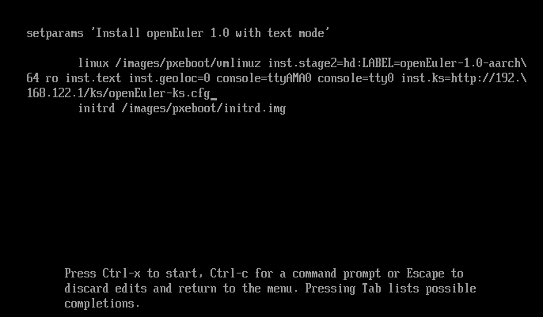

# 半自动化安装指导<a name="ZH-CN_TOPIC_0221430306"></a>

## 环境要求<a name="section624913414504"></a>

使用kickstart进行openEuler系统的半自动化安装的环境要求如下：

-   物理机/虚拟机（虚拟机创建可参考对应厂商的资料）。包括使用kickstart工具进行自动化安装的计算机和被安装的计算机。
-   httpd：存放kickstart文件。
-   ISO：  openEuler-1.0-base-aarch64-dvd.iso

## 操作步骤<a name="section195901411145117"></a>

使用kickstart进行openEuler系统的半自动化安装的操作步骤如下：

**环境准备**

> **说明：**   
>安装之前，请确保http服务器的防火墙处于关闭状态。关闭防火墙可参照如下命令：  
>```  
>iptables -F  
>```  

1.  httpd的安装与服务启动。

    ```
    # dnf install httpd -y
    # systemctl start httpd
    # systemctl enable httpd
    ```

2.  kickstart文件的准备。

    ```
    # mkdir /var/www/html/ks
    # vim /var/www/html/ks/openEuler-ks.cfg ===>根据已安装openEuler系统自动生成的anaconda-ks.cfg修改得到，也可以使用system-config-kickstart工具做成
    ====================================
    ***以下内容需要根据实际需求进行修改***
    #version=DEVEL
    ignoredisk --only-use=sda
    autopart --type=lvm
    # Partition clearing information
    clearpart --none --initlabel
    # Use text mode install
    text
    # Use CDROM installation media
    cdrom
    # Keyboard layouts
    keyboard --vckeymap=cn --xlayouts='cn'
    # System language
    lang zh_CN.UTF-8
    
    # Network information
    network  --bootproto=dhcp --device=enp4s0 --ipv6=auto --activate
    network  --hostname=openeuler.com
    # Root password
    rootpw --iscrypted $6$fQE83lxEZ48Or4zc$j7/PlUMHn29yTjCD4Fi44WTZL/RzVGxJ/7MGsZMl6QfE3KjIVT7M4UrhFXbafvRq2lUddAFcyWHd5WRmXfEK20
    # Run the Setup Agent on first boot
    firstboot --enable
    # Do not configure the X Window System
    skipx
    # System services
    services --disabled="chronyd"
    # System timezone
    timezone Asia/Shanghai --isUtc--nontp
    
    %packages
    @^minimal-environment
    @standard
    
    %end
    
    %anaconda
    pwpolicy root --minlen=8 --minquality=1 --notstrict --nochanges --notempty
    pwpolicy user --minlen=8 --minquality=1 --notstrict --nochanges --emptyok
    pwpolicy luks --minlen=8 --minquality=1 --notstrict --nochanges --notempty
    %end
    
    %post
    #enable kdump
    sed  -i "s/ ro / ro crashkernel=1024M,high /" /boot/efi/EFI/openEuler/grub.cfg
    %end
    =====================================
    ```

    > **说明：**   
    >密码密文生成方式：  
    >\# python3  
    >Python 3.7.0 \(default, Apr  1 2019, 00:00:00\)  
    >\[GCC 7.3.0\] on linux  
    >Type "help", "copyright", "credits" or "license" for more information.  
    >\>\>\> import crypt  
    >\>\>\> passwd = crypt.crypt\("myPasswd"\)  
    >\>\>\> print\(passwd\)  
    >$6$63c4tDmQGn5SDayV$mZoZC4pa9Jdt6/ALgaaDq6mIExiOO2EjzomB.Rf6V1BkEMJDcMddZeGdp17cMyc9l9ML9ldthytBEPVcnboR/0  

3.  将ISO镜像文件挂载到需要安装openEuler计算机的光驱上。

    另外，也可以选择NFS等网络安装，kickstart文件中需要指定安装源位置（默认是cdrom）。


**安装系统**

1.  启动系统进入安装选择界面。
    1.  在“安装指导 \> 启动安装”章节中的“安装引导界面”中选择“Install openEuler 1.0 with text mode”，并按下“e”键。
    2.  启动参数中追加“inst.ks=http://server ip/ks/openEuler-ks.cfg”。

        

    3.  按“Ctrl+x”，开始系统的自动安装。

2.  确认系统安装完毕。

    系统安装完毕以后会自动重启，然后再次进入到安装界面，此时关闭计算机，调整启动顺序（优先从硬盘启动）。

    


