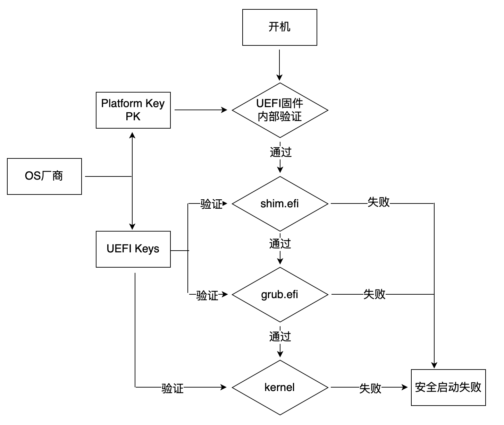
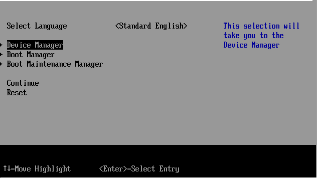
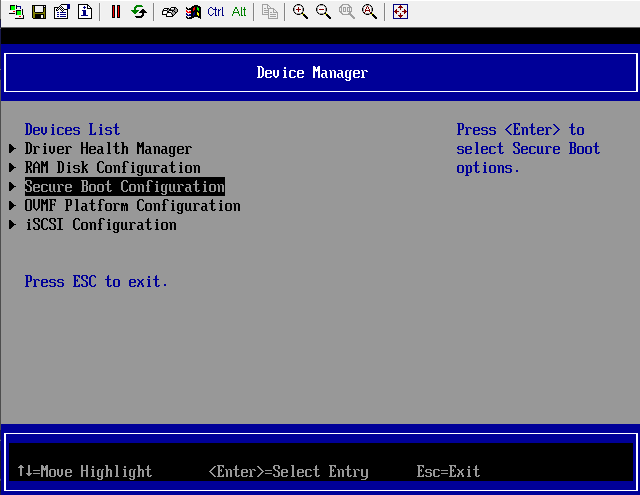
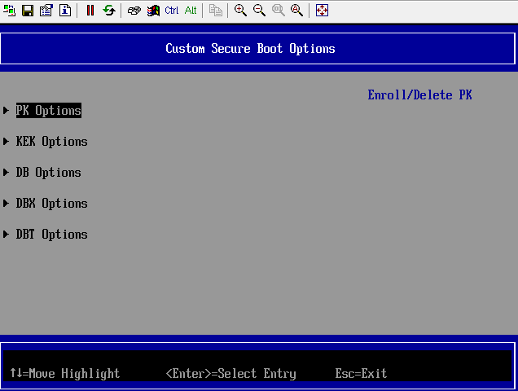
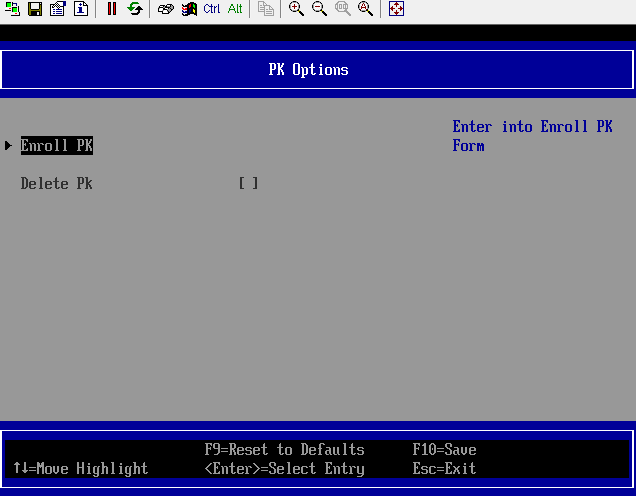
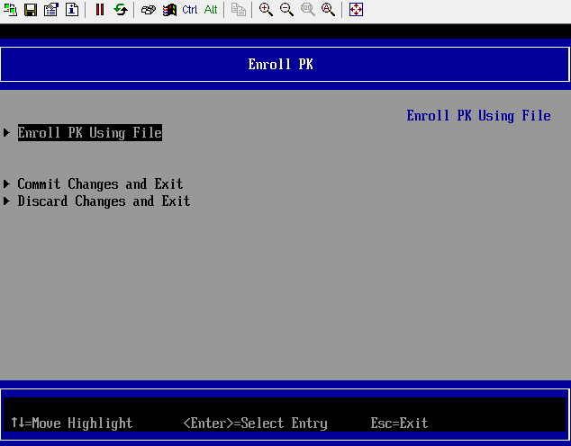
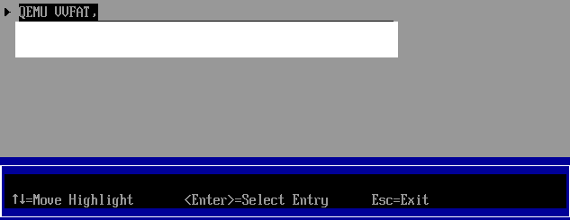
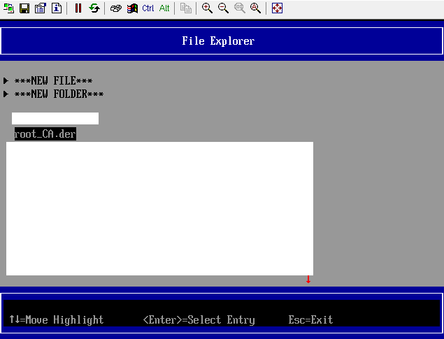
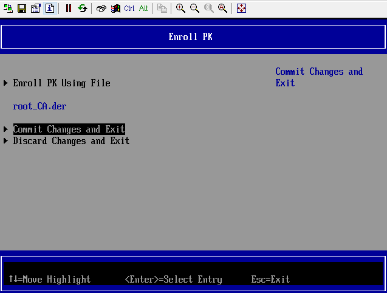

# 管理虚拟机
<!-- TOC -->
-   [管理虚拟机](#管理虚拟机)
    -   [虚拟机生命周期](#虚拟机生命周期)
        -   [总体介绍](#总体介绍)
        -   [管理命令](#管理命令)
        -   [示例](#示例)
    -   [在线修改虚拟机配置](#在线修改虚拟机配置)
    -   [查询虚拟机信息](#查询虚拟机信息)
    -   [登录虚拟机](#登录虚拟机)
        -   [使用VNC密码登录](#使用VNC密码登录)
        -   [配置VNC TLS登录](#配置VNC-TLS登录)
    -   [虚拟机安全启动](#虚拟机安全启动)
        -   [总体介绍](#总体介绍)
        -   [安全启动实践](#安全启动实践)
<!-- /TOC -->

## 虚拟机生命周期

### 总体介绍

#### 概述

为了更好地利用硬件资源，降低成本，用户需要合理地管理虚拟机。本节介绍虚拟机生命周期过程中的基本操作，包括虚拟机创建、使用、删除等，指导用户更好地管理虚拟机。

#### 虚拟机状态

虚拟机主要有如下几种状态：

-   未定义（undefined）：虚拟机未定义或未创建，即libvirt认为该虚拟机不存在。
-   关闭状态（shut off）：虚拟机已经被定义但未运行，或者虚拟机被终止。
-   运行中（running）：虚拟机处于运行状态。
-   暂停（paused）：虚拟机运行被挂起，其运行状态被临时保存在内存中，可以恢复到运行状态。
-   保存（saved）：与暂停（paused）状态类似，其运行状态被保存在持久性存储介质中，可以恢复到运行状态。
-   崩溃（crashed）：通常是由于内部错误导致虚拟机崩溃，不可恢复到运行状态。

#### 状态转换

虚拟机不同状态之间可以相关转换，但必须满足一定规则。虚拟机不同状态之间的转换常用规则如[图1](#fig671014583483)所示。

**图 1**  状态转换图<a name="fig671014583483"></a>  


#### 虚拟机标识

在libvirt中，完成创建的虚拟机实例称做一个“domain”，其描述了虚拟机的CPU、内存、网络设备、存储设备等各种资源的配置信息。在同一个主机上，每个domain具有唯一标识，通过虚拟机名称Name、UUID、Id表示，对应含义请参见[表1](#table84397266483)。在虚拟机生命周期期间，可以通过虚拟机标识对特定虚拟机进行操作。

**表 1**  domain标识说明

<a name="table84397266483"></a>
<table><thead align="left"><tr id="row194391726114819"><th class="cellrowborder" valign="top" width="24.57%" id="mcps1.2.3.1.1"><p id="p1417373404815"><a name="p1417373404815"></a><a name="p1417373404815"></a>标识</p>
</th>
<th class="cellrowborder" valign="top" width="75.42999999999999%" id="mcps1.2.3.1.2"><p id="p12173123414810"><a name="p12173123414810"></a><a name="p12173123414810"></a>含义</p>
</th>
</tr>
</thead>
<tbody><tr id="row143972684815"><td class="cellrowborder" valign="top" width="24.57%" headers="mcps1.2.3.1.1 "><p id="p1173534124817"><a name="p1173534124817"></a><a name="p1173534124817"></a>Name</p>
</td>
<td class="cellrowborder" valign="top" width="75.42999999999999%" headers="mcps1.2.3.1.2 "><p id="p16173193464815"><a name="p16173193464815"></a><a name="p16173193464815"></a>虚拟机名称</p>
</td>
</tr>
<tr id="row1644092654815"><td class="cellrowborder" valign="top" width="24.57%" headers="mcps1.2.3.1.1 "><p id="p917353411487"><a name="p917353411487"></a><a name="p917353411487"></a>UUID</p>
</td>
<td class="cellrowborder" valign="top" width="75.42999999999999%" headers="mcps1.2.3.1.2 "><p id="p19173734104819"><a name="p19173734104819"></a><a name="p19173734104819"></a><span>通用唯一识别码</span></p>
</td>
</tr>
<tr id="row12440626154811"><td class="cellrowborder" valign="top" width="24.57%" headers="mcps1.2.3.1.1 "><p id="p16174193404818"><a name="p16174193404818"></a><a name="p16174193404818"></a>Id</p>
</td>
<td class="cellrowborder" valign="top" width="75.42999999999999%" headers="mcps1.2.3.1.2 "><p id="p14174193464817"><a name="p14174193464817"></a><a name="p14174193464817"></a>虚拟机运行标识</p>
<div class="note" id="note117420341481"><a name="note117420341481"></a><a name="note117420341481"></a><span class="notetitle"> 说明： </span><div class="notebody"><p id="p817413414484"><a name="p817413414484"></a><a name="p817413414484"></a>关闭状态的虚拟机无此标识。</p>
</div></div>
</td>
</tr>
</tbody>
</table>

> **说明：**   
>可通过virsh命令查询虚拟机Id和UUID，操作方法请参见[查询虚拟机信息](#查询虚拟机信息)章节内容。  

### 管理命令

#### 概述

用户可以使用virsh命令工具管理虚拟机生命周期。本节介绍生命周期相关的命令以指导用户使用。

#### 前提条件

-   执行虚拟机生命周期操作之前，需要查询虚拟机状态以确定可以执行对应操作。状态之间的基本转换关系请参见"总体介绍"中的"状态转换"的内容。
-   具备管理员权限。
-   准备好虚拟机XML配置文件。

#### 命令使用说明

用户可以使用virsh命令管理虚拟机生命周期，命令格式为：

```
virsh <operate> <obj> <options>
```

各参数含义如下：

-   _operate_：管理虚拟机生命周期对应操作，例如创建、销毁、启动等。
-   _obj_：命令操作对象，如指定需要操作的虚拟机。
-   _options_：命令选项，该参数可选。

虚拟机生命周期管理各命令如[表1](#table389518422611)所示。其中VMInstanse为虚拟机名称、虚拟机ID或者虚拟机UUID，XMLFile是虚拟机XML配置文件，DumpFile为转储文件，请根据实际情况修改。

**表 1**  虚拟机生命周期管理命令

<a name="table389518422611"></a>
<table><thead align="left"><tr id="row11896124210613"><th class="cellrowborder" valign="top" width="31.669999999999998%" id="mcps1.2.3.1.1"><p id="p148961421461"><a name="p148961421461"></a><a name="p148961421461"></a>命令</p>
</th>
<th class="cellrowborder" valign="top" width="68.33%" id="mcps1.2.3.1.2"><p id="p789618424610"><a name="p789618424610"></a><a name="p789618424610"></a>含义</p>
</th>
</tr>
</thead>
<tbody><tr id="row16896134211610"><td class="cellrowborder" valign="top" width="31.669999999999998%" headers="mcps1.2.3.1.1 "><p id="p37307741012"><a name="p37307741012"></a><a name="p37307741012"></a><strong id="b973047201019"><a name="b973047201019"></a><a name="b973047201019"></a>virsh define </strong>&lt;<em id="i98831715135"><a name="i98831715135"></a><a name="i98831715135"></a>XMLFile</em>&gt;</p>
</td>
<td class="cellrowborder" valign="top" width="68.33%" headers="mcps1.2.3.1.2 "><p id="p7730770101"><a name="p7730770101"></a><a name="p7730770101"></a>定义持久化虚拟机，定义完成后虚拟机处于关闭状态，虚拟机被看作为一个domian实例</p>
</td>
</tr>
<tr id="row118965423615"><td class="cellrowborder" valign="top" width="31.669999999999998%" headers="mcps1.2.3.1.1 "><p id="p1873010791017"><a name="p1873010791017"></a><a name="p1873010791017"></a><strong id="b207308718102"><a name="b207308718102"></a><a name="b207308718102"></a>virsh create </strong>&lt;<em id="i132641341137"><a name="i132641341137"></a><a name="i132641341137"></a>XMLFile</em>&gt;</p>
</td>
<td class="cellrowborder" valign="top" width="68.33%" headers="mcps1.2.3.1.2 "><p id="p97301879104"><a name="p97301879104"></a><a name="p97301879104"></a>创建一个临时性虚拟机，创建完成后虚拟机处于运行状态</p>
</td>
</tr>
<tr id="row1689619421617"><td class="cellrowborder" valign="top" width="31.669999999999998%" headers="mcps1.2.3.1.1 "><p id="p37301474109"><a name="p37301474109"></a><a name="p37301474109"></a><strong id="b20730770108"><a name="b20730770108"></a><a name="b20730770108"></a>virsh start </strong>&lt;<em id="i204711236181813"><a name="i204711236181813"></a><a name="i204711236181813"></a>VMInstanse</em>&gt;</p>
</td>
<td class="cellrowborder" valign="top" width="68.33%" headers="mcps1.2.3.1.2 "><p id="p2073018721010"><a name="p2073018721010"></a><a name="p2073018721010"></a>启动虚拟机</p>
</td>
</tr>
<tr id="row14896442366"><td class="cellrowborder" valign="top" width="31.669999999999998%" headers="mcps1.2.3.1.1 "><p id="p20291141611019"><a name="p20291141611019"></a><a name="p20291141611019"></a><strong id="b729181641014"><a name="b729181641014"></a><a name="b729181641014"></a>virsh shutdown </strong>&lt;<em id="i4966101010166"><a name="i4966101010166"></a><a name="i4966101010166"></a>VMInstanse</em>&gt;</p>
</td>
<td class="cellrowborder" valign="top" width="68.33%" headers="mcps1.2.3.1.2 "><p id="p17319175773610"><a name="p17319175773610"></a><a name="p17319175773610"></a>关闭虚拟机。启动虚拟机关机流程，若关机失败可使用强制关闭</p>
</td>
</tr>
<tr id="row9896134210612"><td class="cellrowborder" valign="top" width="31.669999999999998%" headers="mcps1.2.3.1.1 "><p id="p929111641011"><a name="p929111641011"></a><a name="p929111641011"></a><strong id="b529191691010"><a name="b529191691010"></a><a name="b529191691010"></a>virsh destroy </strong>&lt;<em id="i694273815180"><a name="i694273815180"></a><a name="i694273815180"></a>VMInstanse</em>&gt;</p>
</td>
<td class="cellrowborder" valign="top" width="68.33%" headers="mcps1.2.3.1.2 "><p id="p1029271671016"><a name="p1029271671016"></a><a name="p1029271671016"></a>强制关闭虚拟机</p>
</td>
</tr>
<tr id="row108969421161"><td class="cellrowborder" valign="top" width="31.669999999999998%" headers="mcps1.2.3.1.1 "><p id="p5292191611016"><a name="p5292191611016"></a><a name="p5292191611016"></a><strong id="b112925167108"><a name="b112925167108"></a><a name="b112925167108"></a>virsh reboot </strong>&lt;<em id="i3983440111815"><a name="i3983440111815"></a><a name="i3983440111815"></a>VMInstanse</em>&gt;</p>
</td>
<td class="cellrowborder" valign="top" width="68.33%" headers="mcps1.2.3.1.2 "><p id="p32921616111019"><a name="p32921616111019"></a><a name="p32921616111019"></a>重启虚拟机</p>
</td>
</tr>
<tr id="row48973421767"><td class="cellrowborder" valign="top" width="31.669999999999998%" headers="mcps1.2.3.1.1 "><p id="p1424561235"><a name="p1424561235"></a><a name="p1424561235"></a><strong id="b8424261833"><a name="b8424261833"></a><a name="b8424261833"></a>virsh save </strong> &lt;<em id="i163855131814"><a name="i163855131814"></a><a name="i163855131814"></a>VMInstanse</em>&gt; &lt;<em id="i43271518136"><a name="i43271518136"></a><a name="i43271518136"></a>DumpFile</em>&gt;</p>
</td>
<td class="cellrowborder" valign="top" width="68.33%" headers="mcps1.2.3.1.2 "><p id="p3292916151012"><a name="p3292916151012"></a><a name="p3292916151012"></a>将虚拟机的运行状态转储到文件中</p>
</td>
</tr>
<tr id="row7171162171019"><td class="cellrowborder" valign="top" width="31.669999999999998%" headers="mcps1.2.3.1.1 "><p id="p136882812108"><a name="p136882812108"></a><a name="p136882812108"></a><strong id="b86802814106"><a name="b86802814106"></a><a name="b86802814106"></a>virsh restore </strong>&lt;<em id="i119924133319"><a name="i119924133319"></a><a name="i119924133319"></a>DumpFile</em>&gt;</p>
</td>
<td class="cellrowborder" valign="top" width="68.33%" headers="mcps1.2.3.1.2 "><p id="p868182841017"><a name="p868182841017"></a><a name="p868182841017"></a>从虚拟机状态转储文件恢复虚拟机</p>
</td>
</tr>
<tr id="row1117211217102"><td class="cellrowborder" valign="top" width="31.669999999999998%" headers="mcps1.2.3.1.1 "><p id="p669328161014"><a name="p669328161014"></a><a name="p669328161014"></a><strong id="b106918286103"><a name="b106918286103"></a><a name="b106918286103"></a>virsh suspend </strong>&lt;<em id="i215106151910"><a name="i215106151910"></a><a name="i215106151910"></a>VMInstanse</em>&gt;</p>
</td>
<td class="cellrowborder" valign="top" width="68.33%" headers="mcps1.2.3.1.2 "><p id="p1069182871017"><a name="p1069182871017"></a><a name="p1069182871017"></a>暂停虚拟机的运行，使虚拟机处于pasued状态</p>
</td>
</tr>
<tr id="row1917215213101"><td class="cellrowborder" valign="top" width="31.669999999999998%" headers="mcps1.2.3.1.1 "><p id="p16691428161011"><a name="p16691428161011"></a><a name="p16691428161011"></a><strong id="b1869132812100"><a name="b1869132812100"></a><a name="b1869132812100"></a>virsh resume </strong>&lt;<em id="i14154151015192"><a name="i14154151015192"></a><a name="i14154151015192"></a>VMInstanse</em>&gt;</p>
</td>
<td class="cellrowborder" valign="top" width="68.33%" headers="mcps1.2.3.1.2 "><p id="p469328141011"><a name="p469328141011"></a><a name="p469328141011"></a>唤醒虚拟机，将处于paused状态的虚拟机恢复到运行状态</p>
</td>
</tr>
<tr id="row11173921141013"><td class="cellrowborder" valign="top" width="31.669999999999998%" headers="mcps1.2.3.1.1 "><p id="p1569162812109"><a name="p1569162812109"></a><a name="p1569162812109"></a><strong id="b136913287105"><a name="b136913287105"></a><a name="b136913287105"></a>virsh undefine </strong>&lt;<em id="i2597181811911"><a name="i2597181811911"></a><a name="i2597181811911"></a>VMInstanse</em>&gt;</p>
</td>
<td class="cellrowborder" valign="top" width="68.33%" headers="mcps1.2.3.1.2 "><p id="p369122819106"><a name="p369122819106"></a><a name="p369122819106"></a>销毁持久性虚拟机，虚拟机生命周期完结，不能继续对该虚拟机继续操作</p>
</td>
</tr>
</tbody>
</table>

### 示例

本节给出虚拟机生命周期管理相关命令的示例。

-   创建虚拟机

    虚拟机XML配置文件为openEulerVM.xml，命令和回显如下：

    ```
    # virsh define openEulerVM.xml
    Domain openEulerVM defined from openEulerVM.xml
    ```


-   启动虚拟机

    启动名称为openEulerVM的虚拟机，命令和回显如下：

    ```
    # virsh start openEulerVM
    Domain openEulerVM started
    ```

-   重启虚拟机

    重启名称为openEulerVM的虚拟机，命令和回显如下：

    ```
    # virsh reboot openEulerVM
    Domain openEulerVM is being rebooted
    ```

-   关闭虚拟机

    关闭名称为openEulerVM的虚拟机，命令和回显如下：

    ```
    # virsh shutdown openEulerVM
    Domain openEulerVM is being shutdown
    ```

-   销毁虚拟机
    -   若虚拟机启动时未使用nvram文件，销毁虚拟机命令如下：

        ```
        # virsh undefine <VMInstanse>
        ```

    -   若虚拟机启动时使用了nvram文件，销毁该虚拟机需要指定nvram的处理策略，命令如下：

        ```
        # virsh undefine <VMInstanse> <strategy>
        ```

        其中\<strategy\>为销毁虚拟机的策略，可取值：

        nvram：销毁虚拟机的同时删除其对应的nvram文件。

        keep-nvram：销毁虚拟机，但保留其对应的nvram文件。

        例如，删除虚拟机openEulerVM及其nvram文件，命令和回显如下：

        ```
        # virsh undefine openEulerVM --nvram
        Domain openEulerVM has been undefined
        ```


## 在线修改虚拟机配置

#### 概述

虚拟机创建之后用户可以修改虚拟机的配置信息，称为在线修改虚拟机配置。在线修改配置以后，新的虚拟机配置文件会被持久化，并在虚拟机关闭、重新启动后生效。

修改虚拟机配置命令格式如下：

```
virsh edit <VMInstance>
```

virsh edit命令通过编辑“domain”对应的XML配置文件，完成对虚拟机配置的更新。virsh edit使用vi程序作为默认的编辑器，可以通过修改环境变量“EDITOR”或“VISUAL”指定编辑器类型。virsh edit默认优先使用“VISUAL”环境变量指定的文本编辑器。

#### 操作步骤

1.  （可选）设置virsh edit命令的编辑器为vim。

    ```
    # export VISUAL=vim
    ```

2.  使用virsh edit打开虚拟机名称为openEulerVM对应的XML配置文件。

    ```
    # virsh edit openEulerVM
    ```

3.  修改虚拟机配置文件。
4.  保存虚拟机配置文件并退出。
5.  关闭虚拟机。

    ```
    # virsh shutdown openEulerVM
    ```
6.  启动虚拟机使配置修改生效。

    ```
    # virsh start openEulerVM
    ```

## 查询虚拟机信息

#### 概述

管理员在管理虚拟机的过程中经常需要知道一些虚拟机信息，libvirt提供了一套命令行工具用于查询虚拟机的相关信息。本章介绍相关命令的使用方法，便于管理员来获取虚拟机的各种信息。

#### 前提条件

查询虚拟机信息需要：

-   libvirtd服务处于运行状态。

-   命令行操作需要拥有管理员权限。

#### 查询主机上的虚拟机信息

-   查询主机上处于运行和暂停状态的虚拟机列表。

    ```
    # virsh list
    ```

    例如，下述回显说明当前主机上存在3台虚拟机，其中openEulerVM01、openEulerVM02处于运行状态，openEulerVM03处于暂停状态。

    ```
     Id    Name                           State
    ----------------------------------------------------
     39    openEulerVM01                   running
     40    openEulerVM02                   running
     69    openEulerVM03                   paused
    ```


-   查询主机上已经定义的所有虚拟机信息列表。

    ```
    # virsh list --all
    ```

    例如，下述回显说明当前主机上定义了4台虚拟机，其中虚拟机openEulerVM01处于运行状态，openEulerVM02处于暂停状态，openEulerVM03和openEulerVM04处于关机状态。

    ```
     Id    Name                           State
    ----------------------------------------------------
     39    openEulerVM01                  running
     69    openEulerVM02                  paused
     -     openEulerVM03                  shut off
     -     openEulerVM04                  shut off
    ```


#### 查询虚拟机基本信息

Libvirt组件提供了一组查询虚拟机状态信息的命令，包括虚拟机运行状态、设备信息或者调度属性等，使用方法请参见[表1](#table10582103963816)。

**表 1**  查询虚拟机基本信息

<a name="table10582103963816"></a>
<table><thead align="left"><tr id="row1858320394388"><th class="cellrowborder" valign="top" width="16.41164116411641%" id="mcps1.2.4.1.1"><p id="p11583173983813"><a name="p11583173983813"></a><a name="p11583173983813"></a>查询的信息内容</p>
</th>
<th class="cellrowborder" valign="top" width="37.72377237723772%" id="mcps1.2.4.1.2"><p id="p7583539103816"><a name="p7583539103816"></a><a name="p7583539103816"></a>命令行</p>
</th>
<th class="cellrowborder" valign="top" width="45.86458645864587%" id="mcps1.2.4.1.3"><p id="p85831039103818"><a name="p85831039103818"></a><a name="p85831039103818"></a>说明</p>
</th>
</tr>
</thead>
<tbody><tr id="row1958314393386"><td class="cellrowborder" valign="top" width="16.41164116411641%" headers="mcps1.2.4.1.1 "><p id="p13583133923819"><a name="p13583133923819"></a><a name="p13583133923819"></a>基本信息</p>
</td>
<td class="cellrowborder" valign="top" width="37.72377237723772%" headers="mcps1.2.4.1.2 "><p id="p65831839193819"><a name="p65831839193819"></a><a name="p65831839193819"></a><strong id="b6163104455314"><a name="b6163104455314"></a><a name="b6163104455314"></a>virsh dominfo</strong><em id="i68095290111"><a name="i68095290111"></a><a name="i68095290111"></a> &lt;VMInstance&gt;</em></p>
</td>
<td class="cellrowborder" valign="top" width="45.86458645864587%" headers="mcps1.2.4.1.3 "><p id="p9583183915380"><a name="p9583183915380"></a><a name="p9583183915380"></a>包括虚拟机ID、UUID，虚拟机规格等信息。</p>
</td>
</tr>
<tr id="row1958320393383"><td class="cellrowborder" valign="top" width="16.41164116411641%" headers="mcps1.2.4.1.1 "><p id="p19583839183817"><a name="p19583839183817"></a><a name="p19583839183817"></a>当前状态</p>
</td>
<td class="cellrowborder" valign="top" width="37.72377237723772%" headers="mcps1.2.4.1.2 "><p id="p658312398384"><a name="p658312398384"></a><a name="p658312398384"></a><strong id="b1051304710532"><a name="b1051304710532"></a><a name="b1051304710532"></a>virsh domstate</strong><em id="i452815388117"><a name="i452815388117"></a><a name="i452815388117"></a> &lt;VMInstance&gt;</em></p>
</td>
<td class="cellrowborder" valign="top" width="45.86458645864587%" headers="mcps1.2.4.1.3 "><p id="p2058343913381"><a name="p2058343913381"></a><a name="p2058343913381"></a>可以使用--reason选项查询虚拟机变为当前状态的原因。</p>
</td>
</tr>
<tr id="row175838395384"><td class="cellrowborder" valign="top" width="16.41164116411641%" headers="mcps1.2.4.1.1 "><p id="p105831939153812"><a name="p105831939153812"></a><a name="p105831939153812"></a>调度信息</p>
</td>
<td class="cellrowborder" valign="top" width="37.72377237723772%" headers="mcps1.2.4.1.2 "><p id="p45831439123820"><a name="p45831439123820"></a><a name="p45831439123820"></a><strong id="b48561249175312"><a name="b48561249175312"></a><a name="b48561249175312"></a>virsh schedinfo</strong><em id="i5581174112116"><a name="i5581174112116"></a><a name="i5581174112116"></a> &lt;VMInstance&gt;</em></p>
</td>
<td class="cellrowborder" valign="top" width="45.86458645864587%" headers="mcps1.2.4.1.3 "><p id="p95841339143816"><a name="p95841339143816"></a><a name="p95841339143816"></a>包括vCPU份额<span id="ph4481114523919"><a name="ph4481114523919"></a><a name="ph4481114523919"></a>等</span>信息。</p>
</td>
</tr>
<tr id="row7584439183820"><td class="cellrowborder" valign="top" width="16.41164116411641%" headers="mcps1.2.4.1.1 "><p id="p155841039173810"><a name="p155841039173810"></a><a name="p155841039173810"></a>vCPU数目</p>
</td>
<td class="cellrowborder" valign="top" width="37.72377237723772%" headers="mcps1.2.4.1.2 "><p id="p1858420390389"><a name="p1858420390389"></a><a name="p1858420390389"></a><strong id="b1427395345319"><a name="b1427395345319"></a><a name="b1427395345319"></a>virsh vcpucount<em id="i13236144015290"><a name="i13236144015290"></a><a name="i13236144015290"></a> </em></strong><em id="i3406175013110"><a name="i3406175013110"></a><a name="i3406175013110"></a>&lt;VMInstance&gt;</em></p>
</td>
<td class="cellrowborder" valign="top" width="45.86458645864587%" headers="mcps1.2.4.1.3 "><p id="p155843392381"><a name="p155843392381"></a><a name="p155843392381"></a>查询虚拟机vCPU的个数。</p>
</td>
</tr>
<tr id="row15584193973820"><td class="cellrowborder" valign="top" width="16.41164116411641%" headers="mcps1.2.4.1.1 "><p id="p1258417396387"><a name="p1258417396387"></a><a name="p1258417396387"></a>虚拟块设备状态</p>
</td>
<td class="cellrowborder" valign="top" width="37.72377237723772%" headers="mcps1.2.4.1.2 "><p id="p9584639123820"><a name="p9584639123820"></a><a name="p9584639123820"></a><strong id="b8432175618532"><a name="b8432175618532"></a><a name="b8432175618532"></a>virsh domblkstat </strong><em id="i77100571118"><a name="i77100571118"></a><a name="i77100571118"></a>&lt;VMInstance&gt;</em></p>
</td>
<td class="cellrowborder" valign="top" width="45.86458645864587%" headers="mcps1.2.4.1.3 "><p id="p155841393384"><a name="p155841393384"></a><a name="p155841393384"></a>查询块设备名称可以使用virsh domblklist命令。</p>
</td>
</tr>
<tr id="row05841639153813"><td class="cellrowborder" valign="top" width="16.41164116411641%" headers="mcps1.2.4.1.1 "><p id="p15584163983814"><a name="p15584163983814"></a><a name="p15584163983814"></a>虚拟网卡状态</p>
</td>
<td class="cellrowborder" valign="top" width="37.72377237723772%" headers="mcps1.2.4.1.2 "><p id="p1158411390389"><a name="p1158411390389"></a><a name="p1158411390389"></a><strong id="b14243916105419"><a name="b14243916105419"></a><a name="b14243916105419"></a>virsh domifstat</strong><em id="i11486439121"><a name="i11486439121"></a><a name="i11486439121"></a> &lt;VMInstance&gt;</em></p>
</td>
<td class="cellrowborder" valign="top" width="45.86458645864587%" headers="mcps1.2.4.1.3 "><p id="p10584163919383"><a name="p10584163919383"></a><a name="p10584163919383"></a>查询网卡名称可以使用virsh domiflist命令。</p>
</td>
</tr>
<tr id="row258413397385"><td class="cellrowborder" valign="top" width="16.41164116411641%" headers="mcps1.2.4.1.1 "><p id="p1258483914386"><a name="p1258483914386"></a><a name="p1258483914386"></a>I/O线程</p>
</td>
<td class="cellrowborder" valign="top" width="37.72377237723772%" headers="mcps1.2.4.1.2 "><p id="p55845397381"><a name="p55845397381"></a><a name="p55845397381"></a><strong id="b04151220175413"><a name="b04151220175413"></a><a name="b04151220175413"></a>virsh iothreadinfo </strong><em id="i37361563122"><a name="i37361563122"></a><a name="i37361563122"></a>&lt;VMInstance&gt;</em></p>
</td>
<td class="cellrowborder" valign="top" width="45.86458645864587%" headers="mcps1.2.4.1.3 "><p id="p2058433919382"><a name="p2058433919382"></a><a name="p2058433919382"></a><span id="ph1893663864017"><a name="ph1893663864017"></a><a name="ph1893663864017"></a>查询</span>虚拟机I/O线程及其CPU亲和性<span id="ph636444884015"><a name="ph636444884015"></a><a name="ph636444884015"></a>信息</span>。</p>
</td>
</tr>
</tbody>
</table>

#### 示例

-   使用virsh dominfo查询一个创建好的虚拟机的基本信息，从查询结果可知，虚拟机ID为5，UUID为ab472210-db8c-4018-9b3e-fc5319a769f7，内存大小为8GiB，vCPU数目为4个等。

    ```
    # virsh dominfo openEulerVM
    Id:             5
    Name:           openEulerVM
    UUID:           ab472210-db8c-4018-9b3e-fc5319a769f7
    OS Type:        hvm
    State:          running
    CPU(s):         4
    CPU time:       6.8s
    Max memory:     8388608 KiB
    Used memory:    8388608 KiB
    Persistent:     no
    Autostart:      disable
    Managed save:   no
    Security model: none
    Security DOI:   0
    ```


-   使用virsh domstate查询虚拟机的当前状态，从查询结果可知，虚拟机openEulerVM当前处于运行状态。

    ```
    # virsh domstate openEulerVM
    running
    ```

-   使用virsh schedinfo查询虚拟机的调度信息，从查询结果可知，虚拟机CPU预留份额为1024。

    ```
    # virsh schedinfo openEulerVM
    Scheduler      : posix
    cpu_shares     : 1024
    vcpu_period    : 100000
    vcpu_quota     : -1
    emulator_period: 100000
    emulator_quota : -1
    global_period  : 100000
    global_quota   : -1
    iothread_period: 100000
    iothread_quota : -1
    ```

-   使用virsh vcpucount查询虚拟机的vCPU数目，从查询结构可知，虚拟机有4个CPU。

    ```
    # virsh vcpucount openEulerVM
    maximum      live           4
    current      live           4
    ```

-   使用virsh domblklist查询虚拟机磁盘设备信息，从查询结构可知，虚拟机有2个磁盘，sda是qcow2格式的虚拟磁盘，sdb是一个cdrom设备。

    ```
     # virsh domblklist openEulerVM
     Target   Source
    ---------------------------------------------------------------------
     sda      /home/openeuler/vm/openEuler_aarch64.qcow2
     sdb      /home/openeuler/vm/openEuler-20.09-aarch64-dvd.iso
    ```

-   使用virsh domiflist查询虚拟机网卡信息，从查询结果可知，虚拟机有1张网卡，对应的后端是vnet0在主机br0网桥上，MAC地址为00:05:fe:d4:f1:cc。

    ```
    # virsh domiflist openEulerVM
    Interface  Type       Source     Model       MAC
    -------------------------------------------------------
    vnet0      bridge     br0        virtio      00:05:fe:d4:f1:cc
    ```

-   使用virsh iothreadinfo查询虚拟机I/O线程信息，从查询结果可知虚拟机有5个I/O线程，在物理CPU7-10上进行调度。

    ```
    # virsh iothreadinfo openEulerVM
     IOThread ID     CPU Affinity
    ---------------------------------------------------
     3               7-10
     4               7-10
     5               7-10
     1               7-10
     2               7-10
    ```


## 登录虚拟机

本章介绍使用VNC登录虚拟机的方法。

### 使用VNC密码登录

#### 概述

当虚拟机操作系统安装部署完成之后，用户可以通过VNC协议远程登录虚拟机，从而对虚拟机进行管理操作。

#### 前提条件

使用RealVNC、TightVNC等客户端登录虚拟机，在登录虚拟机之前需要获取如下信息：

-   虚拟机所在主机的IP地址。
-   确保客户端所在的环境可以访问到主机的网络。
-   虚拟机的VNC侦听端口，该端口一般在客户机启动时自动分配，一般为5900 + x（x为正整数，按照虚拟机启动的顺序递增，且5900对用户不可见）。
-   如果VNC设置了密码，还需要获取虚拟机的VNC密码。

    > **说明：**   
    >为虚拟机VNC配置密码，需要编辑虚拟机XML配置文件，即为graphics元素新增一个passwd属性，属性的值为要配置的密码。例如，将虚拟机的VNC密码配置为n8VfjbFK的XML配置参考如下：  
    >```  
    >    <graphics type='vnc' port='5900' autoport='yes' listen='0.0.0.0' keymap='en-us' passwd='n8VfjbFK'>  
    >      <listen type='address' address='0.0.0.0'/>  
    >    </graphics>  
    >```  


#### 操作步骤

1.  查询虚拟机使用的VNC端口号。例如名称为openEulerVM的虚拟机，命令如下：

    ```
    # virsh vncdisplay openEulerVM
    :3
    ```

    > **说明：**   
    >登录 VNC 需要配置防火墙规则，允许 VNC 端口的连接。参考命令如下，其中X为数值“5900 + 端口号” ，例如本例中为5903。  
    >```  
    >firewall-cmd --zone=public --add-port=X/tcp  
    >```  

2.  打开VncViewer软件，输入主机IP和端口号。格式为“主机IP:端口号”，例如：“10.133.205.53:3”。
3.  单击“确定”输入VNC密码（可选），登录到虚拟机VNC进行操作。

### 配置VNC-TLS登录.md">配置VNC TLS登录</h2>

#### 概述

VNC服务端和客户端默认采用明文方式进行数据传输，因此通信内容可能被第三方截获。为了提升安全性，openEuler支持VNC服务端配置TLS模式进行加密认证。TLS（Tansport Layer Security）即传输层安全，可以实现VNC服务端和客户端之间加密通信，从而防止通信内容被第三方截获。

> **说明：**   
>-   使用TLS加密认证模式需要VNC客户端支持TLS模式（例如TigerVNC），否则无法连接到VNC客户端。  
>-   TLS加密认证模式配置粒度为主机服务器级别，开启该特性后，主机上正在运行的所有虚拟机对应的VNC客户端都将开启TLS加密认证模式。  

#### 操作步骤

VNC开启TLS加密认证模式的操作步骤如下：

1.  登录VNC服务端所在主机登录VNC服务端所在主机，开启或修改服务端配置文件/etc/libvirt/qemu.conf中对应的配置项。相关配置内容如下所示：

    ```
    vnc_listen = "x.x.x.x"          # "x.x.x.x"为VNC的侦听地址，请用户根据实际配置，VNC服务端只允许该地址或地址段范围内的客户端连接请求
    vnc_tls = 1                     # 配置为1，表示开启VNC TLS支持
    vnc_tls_x509_cert_dir = "/etc/pki/libvirt-vnc"        #指定证书存放的路径为/etc/pki/libvirt-vnc
    vnc_tls_x509_verify = 1                               #配置为1，表示TLS认证使用X509证书
    ```

2.  为VNC创建证书和私钥文件。此处以GNU TLS为例进行说明。

    > **说明：**   
    >使用GNU TLS，请提前安装好gnu-utils软件包。  

    1.  制作证书颁发机构CA（Certificate Authority）的证书文件。

        ```
        # certtool --generate-privkey > ca-key.pem
        ```

    1.  制作自签名的CA证书公私钥。其中Your organization name为机构名，由用户指定。

        ```
        # cat > ca.info<<EOF
        cn = Your organization name 
        ca
        cert_signing_key
        EOF
        ```

        ```
        # certtool --generate-self-signed \
                 --load-privkey ca-key.pem \
                 --template ca.info \
                 --outfile ca-cert.pem
        ```

        上述生成文件，ca-cert.pem是生成的CA公钥，ca-key.pem是生成的CA私钥，需要由CA妥善保管防止泄露。

    2.  为VNC服务端颁发证书。其中Client Organization Name为实际的服务名称，例如cleint.foo.com，需要用户根据实际指定。

        ```
        # cat > server.info<<EOF
        cn = Server Organization Name
        tls_www_server
        encryption_key
        signing_key
        EOF
        ```

        ```
        # certtool --generate-privkey > server-key.pem
        # certtool --generate-certificate \
                   --load-ca-certificate ca-cert.pem \
                   --load-ca-privkey ca-key.pem \
                   --load-privkey server-key.pem \
                   --template server.info \
                   --outfile server-cert.pem
        ```

        上述生成文件，server-key.pem是VNC服务端的私钥，server-cert.pem是VNC服务端的公钥。

    3.  为VNC客户端颁发证书。

        ```
        # cat > client.info<<EOF
        cn = Client Organization Name
        tls_www_client
        encryption_key
        signing_key
        EOF
        ```

        ```
        # certtool --generate-privkey > client-key.pem
        # certtool --generate-certificate \
                   --load-ca-certificate ca-cert.pem \
                   --load-ca-privkey ca-key.pem \
                   --load-privkey client-key.pem \
                   --template client.info \
                   --outfile client-cert.pem
        ```

        上述生成文件，client-key.pem是VNC客户端的私钥，client-cert.pem是VNC客户端的公钥，生成的公私钥对需要拷贝到VNC客户端。

3.  关闭需要被登录的虚拟机，重启VNC服务端所在主机的libvirtd服务。

    ```
    # systemctl restart libvirtd
    ```

4.  将生成的服务端证书放置到VNC服务端指定目录并将证书的权限改为只允许当前用户读写。

    ```
    # sudo mkdir -m 750 /etc/pki/libvirt-vnc
    # cp ca-cert.pem /etc/pki/libvirt-vnc/ca-cert.pem
    # cp server-cert.pem /etc/pki/libvirt-vnc/server-cert.pem
    # cp server-key.pem /etc/pki/libvirt-vnc/server-key.pem
    # chmod 0600 /etc/pki/libvirt-vnc/*
    ```

5.  将生成的客户端证书ca-cert.pem，client-cert.pem和client-key.pem拷贝到VNC客户端。配置VNC客户端的TLS证书后即可使用VNC TLS登录。

    > **说明：**   
    >-   VNC客户端证书的配置请参见各客户端对应的使用说明，由用户自行配置。  
    >-   登录虚拟机的方式请参见“使用VNC密码登录”。  

## 虚拟机安全启动

### 总体介绍

#### 概述

安全启动（Secure Boot）就是利用公私钥对启动部件进行签名和验证。启动过程中，前一个部件验证后一个部件的数字签名，验证通过后，运行后一个部件，验证不通过则启动失败。安全启动的作用是检测设备启动阶段固件（Fireware）以及软件是否被篡改，防止恶意软件侵入和修改。通过安全启动可以保证系统启动过程中各个部件的完整性，防止没有经过认证的部件被加载运行，从而防止对系统及用户数据产生安全威胁。安全启动是在UEFI启动方式上实现的，Legacy启动方式不支持安全启动。根据UEFI规定，主板出厂的时候可以内置一些可靠的公钥。任何想要在这块主板上加载的操作系统或者硬件驱动程序，都必须通过这些公钥的认证。物理机上的安全启动由物理BIOS完成，虚拟机的安全启动通过软件模拟。虚拟机安全启动流程与host安全启动流程一致，都遵循开源UEFI规范。虚拟化平台上的UEFI由edk组件提供，虚拟机启动时qemu将UEFI镜像映射到内存中，为虚拟机模拟固件启动流程，安全启动正是虚拟机启动过程中edk提供的一个安全保护能力，用来保护虚拟机OS内核不被篡改。安全启动验签顺序：UEFI BIOS->shim->grub->vmlinuz（依次验签通过并加载）。

| 中文 | 英文 | 缩略语 | 中文定义/描述 |
| :-----| :----- | :----- | :----- |
| 安全启动 | Secure boot | Secure boot | 安全启动就是启动过程中，前一个部件验证后一个部件的数字签名，验证通过后，运行后一个部件，验证不通过就停下来。通过安全启动可以保证系统启动过程中各个部件的完整性。 |
| 平台密钥 | Platform key | PK | OEM厂商所有，必须为 RSA 2048 或更强，PK为平台拥有者和平台固件之间建立可信关系。平台拥有者将PK的公钥部分PKpub注册到平台固件中，平台拥有者可以使用PK的私有部分PKpriv来改变平台的拥有权或者注册KEK密钥。 |
| 密钥交换密钥 | Key exchange key | KEK | KEK为平台固件和OS之间创建可信关系。每一个操作系统和与平台固件通信的第三方应用在平台固件中注册KEK密钥的公共部分KEKpub。 |
| 签名数据库 | Database white list | DB | 存储验证shim、grub、vmlinuz等组件的密钥。 |
| 签名吊销数据库 | Database black list | DBx | 存储吊销的密钥。 |

#### 功能说明

本次实现的虚拟机安全启动特性基于edk开源项目。非安全启动模式下，Linux基本流程如下：

**图 1** 系统启动流程图


安全启动模式下UEFI BIOS启动后加载的首个组件是系统镜像中的shim，shim与UEFI BIOS进行交互获取存储在UEFI BIOS变量db里面的密钥对grub进行验证，加载grub后同样调用密钥和认证接口对kernel进行验证。Linux启动流程如下：

**图 2** 安全启动流程图



从整体处理流程上来看，安全启动特性包含多个关键场景，根据场景分析和系统分解，安全启动特性涉及以下几个子系统：UEFI BIOS校验shim，shim校验grub，grub校验kernel。UEFI BIOS对shim进行验证，验证通过则启动shim，不通过则提示错误，无法启动。Shim需要在镜像编译制作过程中使用私钥进行签名，公钥证书导入UEFI BIOS变量区DB中。Shim启动后验证启动grub，验证通过则启动grub，不通过则提示错误，无法启动。Grub需要在镜像编译制作过程中进行签名，使用和shim一样的公私钥对。Grub启动后检查调用shim注册在UEFI BIOS的认证接口和密钥对kernel进行验证，通过则启动内核，不通过则提示错误，grub需要在镜像编译制作过程中进行签名，使用和shim一样的公私钥对。

#### 约束限制

* 在不支持安全启动的UEFI BIOS上运行，对现有功能没有影响，业务无感知。
* 安全启动特性依赖UEFI BIOS，必须在UEFI支持此功能的条件下才能发挥作用。
* 在UEFI BIOS开启安全启动的情况下，如果相关部件没有签名或签名不正确，则无法正常启动系统。
* 在UEFI BIOS关闭安全启动的情况下，启动过程的验证功能都会被关闭。
* 安全启动验证链后半段，即shim->grub->kernel引导内核启动这部分的验证链由操作系统镜像实现，若操作系统不支持引导内核安全启动过程，则虚拟机安全启动失败。
* 当前不提供x86架构使用nvram文件配置虚拟机安全启动

### 安全启动实践

虚拟机安全启动依赖于UEFI BIOS的实现，UEFI BIOS镜像通过edk rpm包安装，本节以AArch64为例对虚拟机安全启动进行配置。

#### 虚拟机配置

edk rpm包中的组件安装于/usr/share/edk2/aarch64目录下，包括`QEMU_EFI-pflash.raw`和`vars-template-pflash.raw`。虚拟机启动UEFI BIOS部分xml配置如下：

```
<os>
    <type arch='aarch64' machine='virt'>hvm</type>
    <loader readonly='yes' type='pflash'>/usr/share/edk2/aarch64/QEMU_EFI-pflash.raw</loader>
    <nvram template='/usr/share/edk2/aarch64/vars-template-pflash.raw'>/path/to/QEMU-VARS.fd</nvram>
</os>
```

其中/usr/share/edk2/aarch64/QEMU_EFI-pflash.raw为UEFI BIOS镜像路径。/usr/share/edk2/aarch64/vars-template-pflash.raw为nvram镜像模板路径，/path/to/QEMU-VARS.fd为当前虚拟机nvram镜像文件路径，用于保存UEFI BIOS系统中的环境变量。

#### 证书导入

虚拟机安全启动时的证书从BIOS界面导入，在证书导入前需要将证书文件导入到虚拟机中。可以通过挂载磁盘的方式将证书文件所在目录挂载到虚拟机中，例如制作包含证书的镜像，并在虚拟机的配置文件xml中配置挂载该镜像：

制作证书文件镜像

```
dd of='/path/to/data.img' if='/dev/zero' bs=1M count=64
mkfs.vfat -I /path/to/data.img
mkdir /path/to/mnt
mount path/to/data.img /path/to/mnt/
cp -a /path/to/certificates/* /path/to/mnt/
umount /path/to/mnt/
```
其中，/path/to/certificates/为证书文件所在路径，/path/to/data.img为证书文件镜像所在路径，/path/to/mnt/为镜像挂载路径。

在虚拟机xml文件中配置挂载该镜像

```
<devices>
	<disk type='file' device='disk'>
		<driver name='qemu' type='raw' cache='none' io='native'/>
		<source file='/path/to/data.img'/>
		<target dev='sdc' bus='scsi'/>
		<boot order='2'/>
		<readonly/>
	</disk>
</devices>
```

启动虚拟机，导入PK证书，流程如下(KEK证书，DB证书导入方式相同)：

虚拟机启动后，点击F2进入bios界面

**图 1** 进入bios界面



**图 2** 进入Device Manager



**图 3** 进入Custom Secure Boot Options



**图 4** 进入PK Options



**图 5** Enroll PK



在File Explorer界面可以看到很多磁盘目录，其中包括我们通过磁盘挂载的证书文件目录

**图 6** File Explorer



在磁盘目录中选择要导入的PK证书

**图 7** 进入证书所在磁盘



**图 8** 选择Commit Changes and Exit保存导入证书



导入证书后，UEFI BIOS将证书信息以及安全启动属性写入nvram配置文件/path/to/QEMU-VARS.fd中，虚拟机下一次启动时会从/path/to/QEMU-VARS.fd文件中读取相关配置并初始化证书信息以及安全启动属性，自动导入证书并开启安全启动。同样，我们可以将/path/to/QEMU-VARS.fd作为其他相同配置虚拟机的UEFI BIOS启动配置模板文件，通过修改nvram template字段使其他虚拟机启动时自动导入证书并开启安全启动选项，虚拟机xml配置修改如下：

```
<os>
    <type arch='aarch64' machine='virt'>hvm</type>
    <loader readonly='yes' type='pflash'>/usr/share/edk2/aarch64/QEMU_EFI-pflash.raw</loader>
    <nvram template='/path/to/QEMU-VARS.fd'></nvram>
</os>
```

#### 安全启动观测

正确配置虚拟机并导入PK、KEK、DB证书后，虚拟机将以安全启动的方式运行。可以通过在虚拟机配置文件xml中配置串口日志文件观测虚拟机是否为安全启动，串口日志文件的配置方式如：

```
<serial type='file'>
	<source path='/path/to/log_file' append='on'/>
</serial>
```

虚拟机加载系统镜像成功后，当串口日志文件中出现"UEFI Secure Boot is enabled"信息时，表明虚拟机当前为安全启动。
